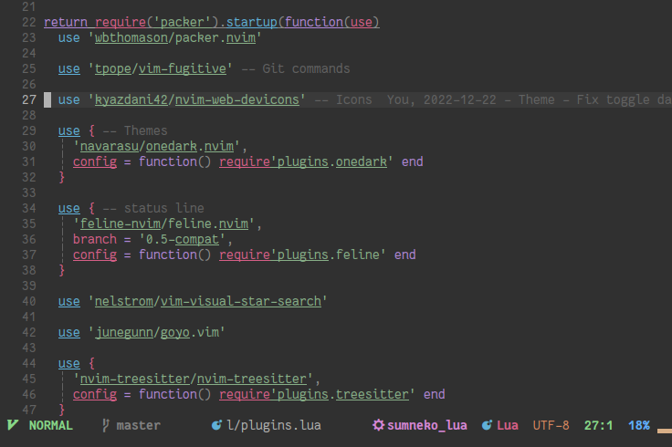

# nvim



## Notes
Neovim must be above **0.5** to work well with lua config,
and some plugin need **0.7** version.

## Commands

### General

- `<leader>+` increase first number in line after the cursor
- `<leader>-` decrease first number in line after the cursor
- `<leader>o` close other splits
- `<leader>w` close buffer
- `<leader>q` quit all
- `<F5>` Refresh buffer
- `<leader>e` refresh buffer

### Visual

- `<leader>t` to switch dark|light theme
- `<leader>g` toggle goyo view mode

### GitSigns

- `]c` next hunk
- `[c` next hunk
- `<leader>hs` stage hunk
- `<leader>hr` reset hunk
- `<leader>hu` undo hunk
- `<leader>hp` preview hunk
- `<leader>hb` preview hunk in popup
- `<leader>tb` preview hunk in line
- `<leader>hd` diff current file

### Telescope

- `<leader>ff` find file
- `<leader>fg` find file with git
- `<leader>ft` find file with tag

### Saga

- `<C-k>` & `<C-j>` to move

### Completion

- `<CR>` to choose selected suggestion

### Lspsaga

- `gf` show definition
- `gD` got to declaration
- `gd` see definition
- `gi` go to implementation
- `<leader>ca` see available code actions
- `<leader>rn` smart rename
- `<leader>D` show diagnostics
- `[d` go to next dianostic
- `]d` go to previous dianostic
- `K` show documentation
- `<leader>s` show structure

#### Typescript specific

- `<leader>rf` rename file & update imports
- `<leader>oi` organize imports
- `<leader>ru` remove unused variables

## Some resources

- https://teukka.tech/luanvim.html
- https://github.com/nanotee/nvim-lua-guide
- https://medium.com/linux-with-michael/a-list-of-all-my-main-neovim-plugins-8ac4ae107e16
- https://vonheikemen.github.io/devlog/tools/build-your-first-lua-config-for-neovim/

## Satisfying (trying) checkhealth

To check run `:checkhealth` in neovim
- Check latest version of `pynvim` is installed (via pip)
- Check npm neovim is installed, but still no enough

## Plugins

### Plugin manager: Packer

### For the first use

[source](https://github.com/wbthomason/packer.nvim#quickstart)


> To get started, first clone this repository to somewhere on your packpath, e.g.:
```shell
git clone --depth 1 https://github.com/wbthomason/packer.nvim\
 ~/.local/share/nvim/site/pack/packer/start/packer.nvim
```
> You must run this or `PackerSync` whenever you make changes to your plugin configuration
> Regenerate compiled loader file
> `:PackerCompile`

### List

<details>
 <summary>`PackerStatus` :</summary>

- LuaSnip
  - Some useful inspiration for snippets: https://github.com/rafamadriz/friendly-snippets
- goyo.vim
- onedark.nvim
- feline.nvim
- PHP_CodeSniffer
- cmp-buffer
- cmp-nvim-lsp
- cmp-path
- cmp_luasnip
- eslint
- gitsigns.nvim
- indent-blankline.nvim
- lspkind.nvim
- lspsaga.nvim
- mason-lspconfig.nvim
- mason.nvim
- mintabline.vim
- nightfox.nvim
- nvim-autopairs
- nvim-cmp
- nvim-comment
- nvim-lint
- nvim-lspconfig
- nvim-surround
- nvim-tree.lua (not loaded)
- nvim-treesitter
  - git_rebase
  - gitattributes
  - gitcommit
  - css
  - dockerfile
  - html
  - javascript
  - jsdoc
  - json
  - json5
  - lua
  - make
  - markdown
  - ninja
  - php
  - python
  - regex
  - ruby
  - scss
  - sql
  - tsx
  - typescript
  - yaml
- nvim-ts-autotag
- nvim-web-devicons
- overlength.vim
- packer.nvim
- plenary.nvim
- telescope.nvim
- typescript.nvim
- vim-ReplaceWithRegister
- vim-fugitive
- vim-tmux-navigator
- vim-visual-star-search
</details>

## External dependencies

- `ripgrep`
- `fd-find`
- `python3`
- `pip`
- `pynvim`
- `npm`
  - `neovim`
  - `eslint`
- `nerd font`
  - https://www.nerdfonts.com/
- `composer`
  - `phpcs`
    - `composer global require "squizlabs/php_codesniffer=*"`  [source](https://github.com/squizlabs/PHP_CodeSniffer#composer)
